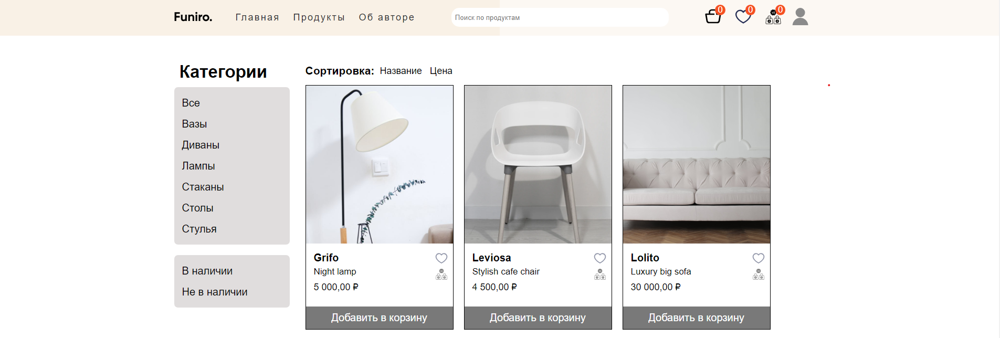

<div align="center">

# Funiro.

## Интернет магазин дизайнерской мебели
</div>

## Предпросмотр главной страницы и страницы с продуктами



## Сайт разработан с помощью:
+ ***Python/Django***
+ ***HTML/CSS***
+ ***SQLite***

## :heavy_exclamation_mark:Будущие нововведения::heavy_exclamation_mark:

:heavy_check_mark: Адаптация сайта под мобильные устройства

:heavy_check_mark: Восстановление пароля от личного кабинета

:heavy_check_mark: 

## Установка проекта:
```bash
git clone https://github.com/pavellukyanov08/FuniroOnlineShop_Project.git
pip install requirements.txt
python manage.py makemigrations
python manage.py migrate
python manage.py runserver
```

## Вход в личный кабинет доступен по учетным записям ниже или через самостоятельную регистрацию:
user1 (123);

user2 (123);

## Управление сайтом (admin)
**Добавление товара:**

Кнопка "Добавить товар" находится в появляющемся меню при наведении на иконку пользоватся в шапке сайте

**Управление товаром:**

1)  Изменение информации о товаре:
    +  Открыть карточку товара путем нажатия на его название
    +  Внести изменения, нажав кнопку сохранить
2) Удаление товара:
    + Открыть карточку товара
    + Нажать кнопку удалить
  
**На сайте присутствует система скидочных цен:**

Управлять скидками можно в карточке товара

